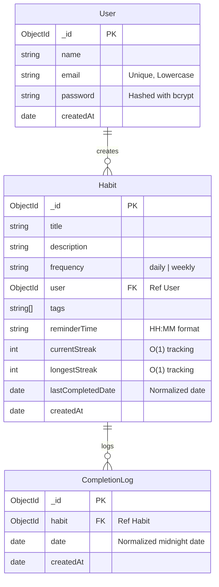

# Personal Habit Tracking & Streak Management REST API

A production-ready, backend-only habit tracker REST API built using **Node.js, Express, and MongoDB (Mongoose)**. It provides user authentication, habit management, daily completion logging, and optimized `O(1)` streak calculations.

---

## 🌐 Live Deployment & Interactive Testing

The API is fully deployed in the cloud and connected to MongoDB Atlas. You can access and test all endpoints visually using the Swagger UI page without running any local servers:

👉 **Live Swagger UI: [https://habbit-tracker-api.onrender.com](https://habbit-tracker-api.onrender.com)**

### 🧪 Pre-seeded Testing Account
Use this pre-registered account to authorize your requests in Swagger and start testing immediately:
* **Email:** `cloud_tester@example.com`
* **Password:** `password123`

---

## 🛠️ Tech Stack
- **Runtime Environment**: Node.js (ES6+ Javascript)
- **Framework**: Express
- **Database**: MongoDB (Object modeling with Mongoose)
- **Security & Cryptography**: JWT (JSON Web Tokens) & bcrypt (password hashing)
- **Time/Date Management**: Day.js (normalized calendar date tracking)
- **Testing Suite**: Jest & Supertest
- **API Documentation**: Swagger UI (`swagger-ui-express`)

---

## 📊 Database Schema Design

This project uses Mongoose to interact with MongoDB. The relations and schemas are structured as follows:



> [!NOTE]
> The `CompletionLog` collection uses a **compound unique index** `{ habit: 1, date: 1 }` to guarantee that a habit can only be tracked once per calendar day at the database layer.

---

## 🚀 Setup & Installation Instructions

### 1. Clone the repository and install dependencies:
```bash
npm install
```

### 2. Configure Environment Variables
Create a `.env` file in the root directory:
```env
PORT=5000
MONGODB_URI="your_mongodb_atlas_connection_string"
JWT_SECRET="your_secure_jwt_secret_key"
```

### 3. Run the Server
* **Development mode** (with hot reloading via nodemon):
  ```bash
  npm run dev
  ```
* **Production mode**:
  ```bash
  npm start
  ```

### 4. Run Integration Tests
```bash
npm test
```

---

## 📖 API Documentation & Swagger UI

Interactive API documentation is generated using OpenAPI 3.0 specs and served directly via Swagger UI.

Once the server is running, navigate to:
👉 **[http://localhost:5000/api-docs](http://localhost:5000/api-docs)**

---

## 🔑 Authentication & Route Protection

All habit-related endpoints require a valid JWT token in the request header. 

### Header Format:
```http
Authorization: Bearer <your_jwt_token_here>
```

---

## 🗺️ Route References Summary

### Authentication Routes
| Method | Endpoint | Description | Auth Required |
| :--- | :--- | :--- | :--- |
| **POST** | `/api/v1/auth/register` | Register a new user | No |
| **POST** | `/api/v1/auth/login` | Authenticate user & get JWT | No |

### Habit CRUD & Tracking Routes
| Method | Endpoint | Description | Auth Required |
| :--- | :--- | :--- | :--- |
| **POST** | `/api/v1/habits` | Create a new habit | **Yes** |
| **GET** | `/api/v1/habits` | Get all habits (supports tags & pagination) | **Yes** |
| **GET** | `/api/v1/habits/:id` | Get details of a single habit | **Yes** |
| **PUT** | `/api/v1/habits/:id` | Update habit details | **Yes** |
| **DELETE** | `/api/v1/habits/:id` | Delete a habit | **Yes** |
| **POST** | `/api/v1/habits/:id/track` | Log habit completion for today | **Yes** |
| **GET** | `/api/v1/habits/:id/history` | Get 7-day completion history & stats | **Yes** |

---

## ✉️ Request/Response Payload Examples

### 1. Register User (`POST /auth/register`)
* **Request Body**:
  ```json
  {
    "name": "Harsh Kankariya",
    "email": "harsh@example.com",
    "password": "password123"
  }
  ```
* **Response (201 Created)**:
  ```json
  {
    "status": "success",
    "token": "eyJhbGciOiJIUzI1NiIsInR5cCI6IkpXVCJ9...",
    "data": {
      "user": {
        "id": "6a76bdcae2087a95287afc8f",
        "name": "Harsh Kankariya",
        "email": "harsh@example.com"
      }
    }
  }
  ```

### 2. Create Habit (`POST /habits`)
* **Request Body**:
  ```json
  {
    "title": "Drink Water",
    "description": "Drink 3 Liters daily",
    "frequency": "daily",
    "tags": ["health", "fitness"],
    "reminderTime": "08:00"
  }
  ```
* **Response (201 Created)**:
  ```json
  {
    "status": "success",
    "data": {
      "habit": {
        "title": "Drink Water",
        "description": "Drink 3 Liters daily",
        "frequency": "daily",
        "user": "6a76bdcae2087a95287afc8f",
        "tags": ["health", "fitness"],
        "reminderTime": "08:00",
        "currentStreak": 0,
        "longestStreak": 0,
        "_id": "6a76bde0e2087a95287afc93",
        "createdAt": "2026-08-08T05:25:52.155Z",
        "updatedAt": "2026-08-08T05:25:52.155Z"
      }
    }
  }
  ```

### 3. Track Habit Completion (`POST /habits/:id/track`)
* **Response (200 OK)**:
  ```json
  {
    "status": "success",
    "message": "Habit tracked successfully!",
    "data": {
      "log": {
        "habit": "6a76bde0e2087a95287afc93",
        "date": "2026-08-07T18:30:00.000Z",
        "_id": "6a76c36ec87085dd7d241631",
        "createdAt": "2026-08-08T05:49:34.764Z"
      },
      "streaks": {
        "currentStreak": 1,
        "longestStreak": 1
      }
    }
  }
  ```

### 4. Fetch Habit History (`GET /habits/:id/history`)
* **Response (200 OK)**:
  ```json
  {
    "status": "success",
    "data": {
      "streaks": {
        "currentStreak": 1,
        "longestStreak": 1
      },
      "recentLogs": [
        {
          "_id": "6a76c36ec87085dd7d241631",
          "habit": "6a76bde0e2087a95287afc93",
          "date": "2026-08-07T18:30:00.000Z",
          "createdAt": "2026-08-08T05:49:34.764Z"
        }
      ]
    }
  }
  ```
